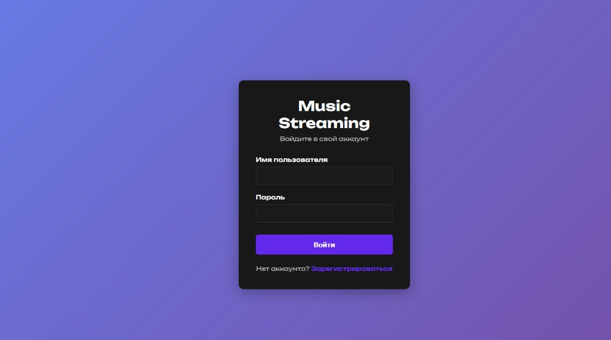
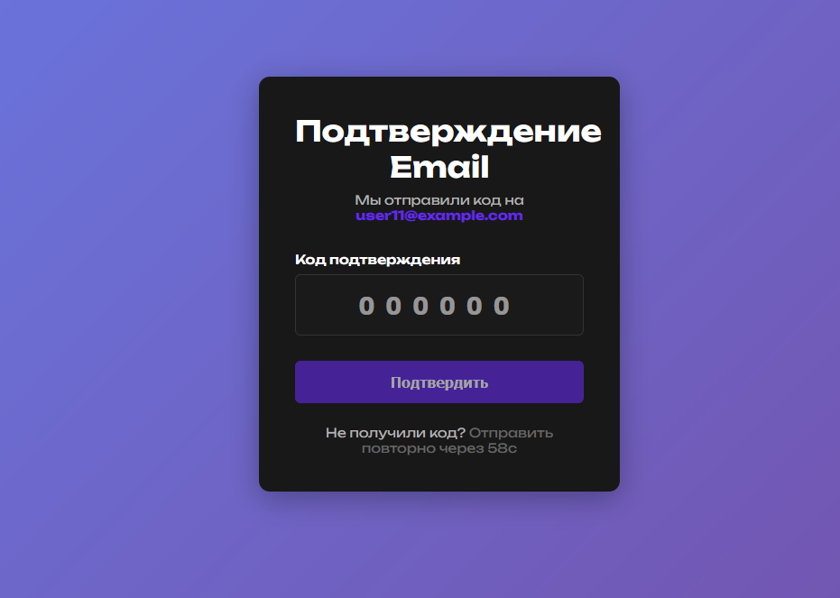
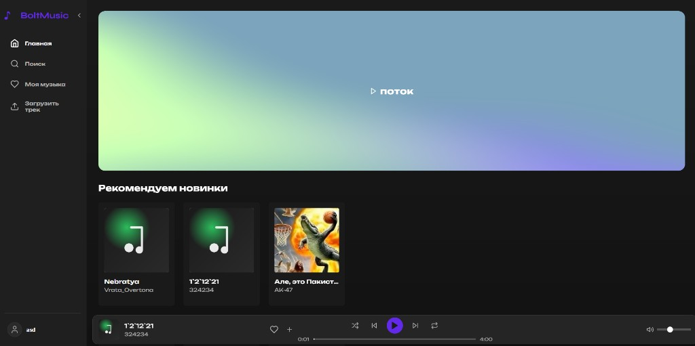
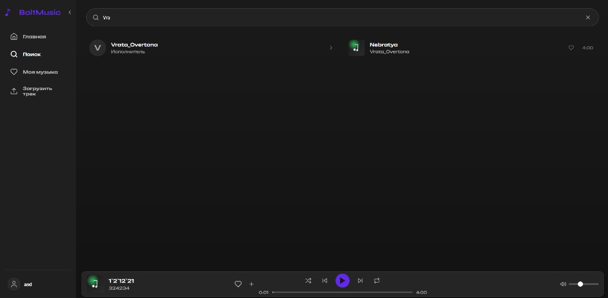
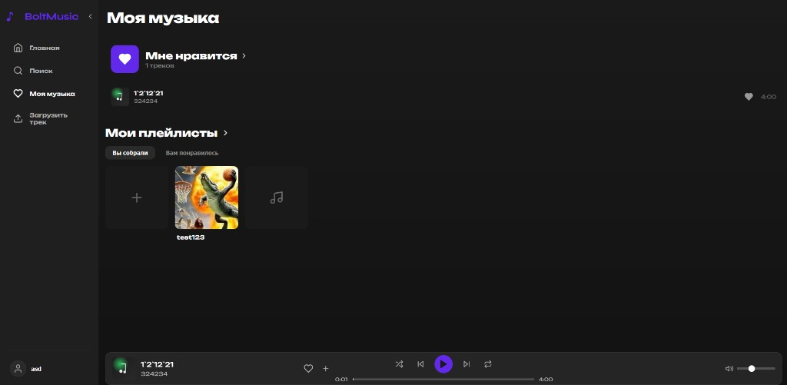
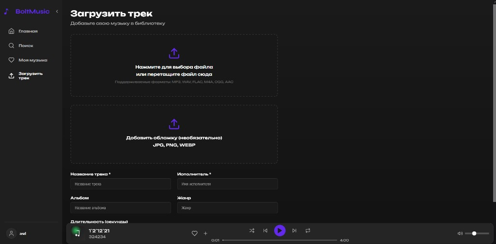
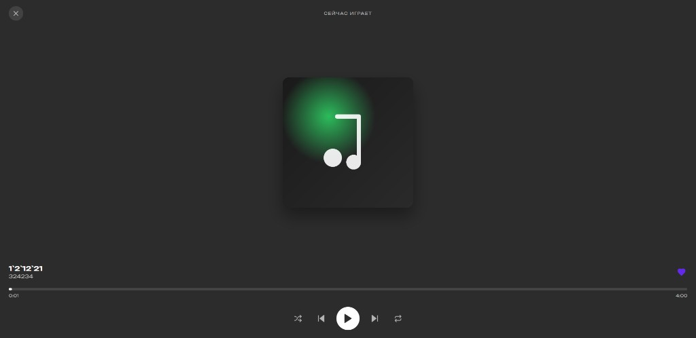

# Bolt Music 

Сервис для стриминга музыки — бэкенд на FastAPI, фронт на React. По сути свой маленький спотифай/яндекс-музыка.

## Стек

- Бэкенд: Python, FastAPI
- Фронт: React (Vite)
- БД: PostgreSQL
- Кэш: Redis
- Всё поднимается через Docker Compose

## Что умеет

- Регистрация и вход (с верификацией почты)
- Поиск по трекам, плейлистам и пользователям
- Плейлисты: создание, редактирование, добавление/удаление треков
- Рекомендации на основе того, что слушал
- Лайки треков
- Прослушивание треков, счётчик прослушиваний
- Загрузка своих треков (MP3, WAV, FLAC, M4A, OGG, AAC)

## Скриншоты

Вход в аккаунт:



Подтверждение email:



Главная и рекомендации:



Поиск:



Моя музыка и плейлисты:



Загрузка трека:



Плеер (сейчас играет):



## Как запустить

Нужны Docker и Docker Compose.

```bash
docker-compose up --build
```

После запуска:
- Фронт: http://localhost:3000
- API: http://localhost:8000
- PostgreSQL: 5432, Redis: 6379

Остановить: `docker-compose down`. С удалением данных: `docker-compose down -v`.

## Структура

```
music-service/
├── backend/          # FastAPI
│   └── app/
│       ├── routers/  # эндпоинты
│       ├── models.py
│       ├── schemas.py
│       └── main.py
├── frontend/         # React
│   └── src/
│       ├── components/
│       ├── pages/
│       ├── store/
│       └── services/
└── docker-compose.yml
```

## API (кратко)

**Авторизация:** `POST /api/auth/register`, `POST /api/auth/login`, `GET /api/auth/me`

**Треки:** `GET/POST /api/tracks`, `POST /api/tracks/upload`, лайки — `POST/DELETE /api/tracks/{id}/like`, `GET /api/tracks/me/liked`

**Плейлисты:** CRUD по `/api/playlists`, добавление/удаление трека: `POST/DELETE /api/playlists/{id}/tracks/{track_id}`

**Поиск:** `GET /api/search?q=...`

**Рекомендации:** `GET /api/recommendations`

## Разработка без Docker

Бэкенд:

```bash
cd backend
python -m venv venv
venv\Scripts\activate   # или source venv/bin/activate на линуксе
pip install -r requirements.txt
uvicorn app.main:app --reload
```

Фронт:

```bash
cd frontend
npm install
npm run dev
```

Не забудь поднять PostgreSQL и Redis отдельно (или через docker только для них).

## Загрузка треков

Через интерфейс: залогинься → «Загрузить трек» в меню → файл + метаданные.

Через API — `POST /api/tracks/upload` (multipart: file, title, artist, album, genre, duration) или `POST /api/tracks` с JSON для ручного добавления (если файл уже лежит на диске).


Лицензия: MIT
